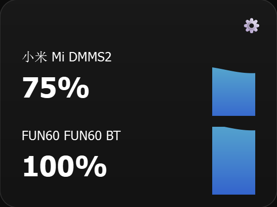

# MiBatter 🪫

> 一个 Windows 桌面小组件，用于实时显示蓝牙键盘、鼠标等设备的电量。



---

## 📦 快速使用（免安装）

1. 前往 [Releases](https://github.com/xiean676/MiBatter/releases) 页面
2. 下载最新版本的 `BatteryWidget.exe`
3. 双击运行即可

> ⚠️ 首次运行若被杀毒软件拦截，请选择「仍要运行」。exe 使用 PyInstaller 打包，源码可见，无恶意行为。

---

## 🐍 源码运行

如果你希望从源码运行，或者自定义修改：

### 前置条件

- Windows 10/11（依赖 `pywinrt` 读取蓝牙信息）
- Python 3.9+

### 步骤

```bash
# 1. 克隆仓库
git clone https://github.com/xiean676/MiBatter.git
cd MiBatter

# 2. 安装依赖
pip install -r requirements.txt

# 3. 运行
python main.py
```

或者直接双击 `start.bat` 启动（使用 `pythonw` 后台运行，无控制台窗口）。

---

## 🧱 手动打包

如果你想自己打包成 exe：

```bash
pip install pyinstaller
pyinstaller battery_widget.spec
```

打包后的 exe 位于 `dist/BatteryWidget.exe`。

---

## 🗂️ 项目结构

```
MiBatter/
├── main.py                  # 程序入口
├── widget.py                # 主窗口（任务栏常驻 + 电量面板）
├── battery_card.py          # 单个设备电池卡片 UI
├── liquid_bar.py            # 液态进度条动画组件
├── bluetooth_monitor.py     # 蓝牙设备电量监控核心
├── requirements.txt         # Python 依赖
├── battery_widget.spec      # PyInstaller 打包配置
├── icon.ico                 # 应用图标
├── start.bat                # 双击启动（后台无窗口）
├── .gitignore
└── README.md
```

---

## ⚙️ 功能说明

- **任务栏托盘图标** — 启动后驻留在系统托盘中
- **实时电量显示** — 自动检测已连接的蓝牙键盘/鼠标并显示电量
- **液态动画进度条** — 每个设备以液态填充动画展示剩余电量
- **自动刷新** — 定期更新电量数据

---

## 🛠️ 技术栈

| 技术 | 用途 |
|------|------|
| Python 3.12 | 开发语言 |
| PyQt6 | 桌面 UI |
| pywinrt | Windows Bluetooth LE API |
| PyInstaller | 打包为独立 exe |

---

## 📄 许可证

MIT License © 2024 xiean676
